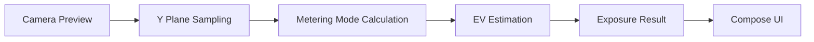

# LumaMeter

LumaMeter is an Android light meter app built with Jetpack Compose and CameraX. It uses camera-frame luminance sampling to estimate scene brightness and provides basic exposure guidance such as EV, aperture, shutter speed, and ISO.

The current version is an MVP focused on a fast metering workflow, a modern Material 3 interface, and a clean architecture that is easy to extend.

## Overview

- Real-time camera preview
- Live luminance analysis based on the camera Y plane
- Three metering modes
  - Average
  - Center Weighted
  - Spot
- Two exposure priority modes
  - Aperture Priority
  - Shutter Priority
- Live EV, aperture, shutter, and ISO display
- Tap-to-meter interaction
- AE Lock
- Exposure compensation
- Calibration offset
- English and Simplified Chinese localization
- Material 3 UI

## Why This App

LumaMeter is designed to answer three questions quickly:

1. Where should I meter?
2. Which parameter should I control?
3. What exposure combination should I use right now?

That is why the app is centered around a single main screen instead of a deep multi-page workflow.

## Screens

The repository does not include screenshots yet. Recommended assets to add later:

- Main metering screen
- Control sheet
- Localization preview

Example README image section:

```md


```

## Features

### Metering

- Real-time luminance sampling from the camera feed
- Spot metering via tap gesture
- Center-weighted metering for fast general use
- Average metering for full-frame brightness estimation

### Exposure

- EV estimation from luminance
- Exposure recommendation based on ISO and selected priority mode
- AE Lock for freezing the current result
- Exposure compensation from the control sheet
- Calibration offset for device-specific adjustment

### UX

- One-screen-first workflow
- Material 3 design language
- Bottom-sheet controls for parameter adjustment
- Bilingual UI resources

## Architecture

The project follows a lightweight `Clean Architecture + MVVM` style:

```text
UI (Jetpack Compose / Material 3)
  -> ViewModel (state + interaction)
    -> Domain (exposure calculation)
      -> Data (CameraX luminance analyzer)
```

### Data Flow



### Layer Responsibilities

- `ui/`
  - Screens, panels, gestures, and Material 3 presentation
- `viewmodel/`
  - UI state aggregation, AE Lock, compensation, calibration, and mode switching
- `domain/exposure/`
  - Pure Kotlin exposure models and calculation logic
- `data/camera/`
  - CameraX analyzer for luminance extraction from the Y channel

## Project Structure

```text
app/src/main/java/com/yourbrand/lumameter/pro/
|-- MainActivity.kt
|-- data/
|   `-- camera/
|       `-- LuminanceAnalyzer.kt
|-- domain/
|   `-- exposure/
|       |-- ExposureCalculator.kt
|       `-- ExposureModels.kt
|-- ui/
|   |-- meter/
|   |   |-- MeterCameraPreview.kt
|   |   `-- MeterScreen.kt
|   `-- theme/
|       |-- Color.kt
|       |-- Theme.kt
|       `-- Type.kt
`-- viewmodel/
    `-- MeterViewModel.kt
```

## Tech Stack

- Kotlin
- Android Gradle Plugin 9.1.0
- Jetpack Compose
- Material 3
- CameraX
- ViewModel
- StateFlow
- Coroutines

## Metering Strategy

The current implementation uses a practical luminance-based approximation:

1. Sample brightness from the image Y channel
2. Apply the selected metering mode
3. Map luminance to `EV100`
4. Convert EV to exposure recommendations using ISO, compensation, and calibration offset

This makes the current version suitable for:

- quick exposure reference
- general shooting assistance
- future extension into a more advanced meter

It should not yet be treated as a fully calibrated replacement for a dedicated professional light meter.

## Localization

The app currently supports:

- English
- Simplified Chinese

Resource files:

- `app/src/main/res/values/strings.xml`
- `app/src/main/res/values-zh/strings.xml`

User-facing text has been extracted from UI and state handling so more locales can be added later with minimal code changes.

## Getting Started

### Requirements

- Android Studio
- JDK 17 or newer
- Android SDK and build tools
- An Android device or emulator with camera support

### Run the App

1. Open the project in Android Studio
2. Wait for Gradle sync to finish
3. Run the `app` module
4. Grant camera permission on first launch

### Build

macOS / Linux:

```bash
./gradlew assembleDebug
```

Windows:

```powershell
.\gradlew.bat assembleDebug
```

## Testing

Current test coverage includes a basic domain-level unit test:

- `ExposureCalculatorTest`

Recommended future additions:

- ViewModel state tests
- metering mode calculation tests
- UI screenshot tests
- analyzer edge-case tests

## Current Status

Implemented:

- Main metering screen MVP
- CameraX preview and luminance analysis
- EV and exposure recommendation
- AE Lock
- Exposure compensation
- Calibration offset
- English and Chinese localization

Planned:

- History records
- Settings screen
- Sensor-assisted metering
- Better device calibration strategy
- Screenshots and store-style documentation assets

## Roadmap

- [x] Real-time metering screen
- [x] Spot / Average / Center Weighted metering
- [x] Aperture / Shutter priority modes
- [x] Material 3 UI
- [x] English and Chinese localization
- [ ] History
- [ ] Settings
- [ ] Lux sensor support
- [ ] Improved calibration workflow
- [ ] Screenshots and release assets

## Notes

- The app currently behaves more like an exposure reference tool than a professionally calibrated meter.
- For serious photography workflows, device calibration and sensor-assisted metering should be added next.

## License

No `LICENSE` file is included yet.

If you plan to publish the project, consider adding a standard license such as:

- MIT
- Apache-2.0
