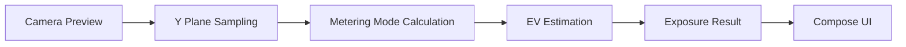

# LumaMeter

[English](README.md) | [简体中文](README.zh-CN.md)

LumaMeter is an Android light meter app built with Jetpack Compose and CameraX. It uses camera-frame luminance sampling to estimate scene brightness and provides basic exposure guidance such as EV, aperture, shutter speed, and ISO.

The current version is an MVP focused on a fast metering workflow, a modern Material 3 interface, and a clean architecture that is easy to extend.

## Overview

- Real-time camera preview
- Live luminance analysis based on the camera Y plane
- Three metering modes
  - Average
  - Center Weighted
  - Spot
- Two exposure priority modes
  - Aperture Priority
  - Shutter Priority
- Live EV, aperture, shutter, and ISO display
- Tap-to-meter interaction
- AE Lock
- Exposure compensation
- Calibration offset
- English and Simplified Chinese localization
- Material 3 UI

## Why This App

LumaMeter is designed to answer three questions quickly:

1. Where should I meter?
2. Which parameter should I control?
3. What exposure combination should I use right now?

That is why the app is centered around a single main screen instead of a deep multi-page workflow.

## Screens

The repository does not include screenshots yet. Recommended assets to add later:

- Main metering screen
- Control sheet
- Localization preview

Example README image section:

```md


```

## Features

### Metering Workflow

- Real-time metering with CameraX preview and Y-plane luminance sampling
- Single-shot metering mode for tap-once capture without continuous updates
- Spot, Center Weighted, and Average metering modes
- Tap-to-reposition metering point with an on-preview reticle
- Live EV, metered luma, and average luma readout

### Exposure Controls

- Aperture Priority and Shutter Priority exposure recommendations
- ISO presets from 50 to 6400
- AE Lock for freezing the current reading
- Exposure compensation slider from `-3 EV` to `+3 EV`
- Calibration offset adjustment from `-2 EV` to `+2 EV`

### Workflow And UI

- One-screen-first metering flow with preview, result, and primary controls together
- Settings page for switching between live metering and single-shot metering
- Follow System, Light, and Dark theme options with saved preference
- Aperture and shutter libraries with custom value add/remove flows
- Zoom controls with preset buttons and slider on supported cameras
- English and Simplified Chinese localization

## Architecture

The project follows a lightweight `Clean Architecture + MVVM` style:

```text
UI (Jetpack Compose / Material 3)
  -> ViewModel (state + interaction)
    -> Domain (exposure calculation)
      -> Data (CameraX luminance analyzer)
```

### Data Flow



### Layer Responsibilities

- `ui/`
  - Screens, panels, gestures, and Material 3 presentation
- `viewmodel/`
  - UI state aggregation, AE Lock, compensation, calibration, and mode switching
- `domain/exposure/`
  - Pure Kotlin exposure models and calculation logic
- `data/camera/`
  - CameraX analyzer for luminance extraction from the Y channel

## Project Structure

```text
app/src/main/java/com/yourbrand/lumameter/pro/
|-- MainActivity.kt
|-- data/
|   `-- camera/
|       `-- LuminanceAnalyzer.kt
|-- domain/
|   `-- exposure/
|       |-- ExposureCalculator.kt
|       `-- ExposureModels.kt
|-- ui/
|   |-- meter/
|   |   |-- MeterCameraPreview.kt
|   |   `-- MeterScreen.kt
|   `-- theme/
|       |-- Color.kt
|       |-- Theme.kt
|       `-- Type.kt
`-- viewmodel/
    `-- MeterViewModel.kt
```

## Tech Stack

- Kotlin
- Android Gradle Plugin 9.1.0
- Jetpack Compose
- Material 3
- CameraX
- ViewModel
- StateFlow
- Coroutines

## Metering Strategy

The current implementation uses a practical luminance-based approximation:

1. Sample brightness from the image Y channel
2. Apply the selected metering mode
3. Map luminance to `EV100`
4. Convert EV to exposure recommendations using ISO, compensation, and calibration offset

This makes the current version suitable for:

- quick exposure reference
- general shooting assistance
- future extension into a more advanced meter

It should not yet be treated as a fully calibrated replacement for a dedicated professional light meter.

## Localization

The app currently supports:

- English
- Simplified Chinese

Resource files:

- `app/src/main/res/values/strings.xml`
- `app/src/main/res/values-zh/strings.xml`

User-facing text has been extracted from UI and state handling so more locales can be added later with minimal code changes.

## Getting Started

### Requirements

- Android Studio
- JDK 17 or newer
- Android SDK and build tools
- An Android device or emulator with camera support

### Run the App

1. Open the project in Android Studio
2. Wait for Gradle sync to finish
3. Run the `app` module
4. Grant camera permission on first launch

### Build

macOS / Linux:

```bash
./gradlew assembleDebug
```

Windows:

```powershell
.\gradlew.bat assembleDebug
```

## Testing

Current test coverage includes domain-level and state-level unit tests:

- `ExposureCalculatorTest`
- `MeterViewModelTest`

Recommended future additions:

- metering mode calculation tests
- UI screenshot tests
- analyzer edge-case tests
- CameraX permission and lifecycle instrumentation tests

## Current Status

Implemented:

- Live metering and single-shot metering workflows
- Spot / Center Weighted / Average metering with tap-to-move meter point
- Aperture Priority / Shutter Priority exposure solving with ISO presets
- AE Lock, exposure compensation, and calibration offset
- Theme settings, zoom controls, and English / Chinese localization
- Custom aperture and shutter libraries
- Basic unit coverage for exposure logic and ViewModel state transitions

Planned:

- Reading history and result review
- Sensor-assisted or fused metering modes
- Stronger device calibration workflow and profiles
- Persistence for custom value libraries and more user preferences
- Screenshots, demo images, and release assets
- Broader UI and instrumentation test coverage

## Roadmap

- [x] Real-time metering screen
- [x] Single-shot metering mode
- [x] Spot / Average / Center Weighted metering
- [x] Aperture / Shutter priority modes
- [x] AE Lock, compensation, and calibration controls
- [x] Theme settings and bilingual localization
- [x] Custom aperture / shutter value libraries
- [x] Zoom controls for supported cameras
- [ ] Reading history
- [ ] Sensor-assisted / lux metering
- [ ] Persistence for custom value libraries and richer preferences
- [ ] Improved calibration workflow and device profiles
- [ ] Screenshots and release assets
- [ ] Expanded UI / instrumentation test coverage
