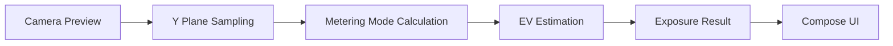

# LumaMeter

[English](README.md) | [简体中文](README.zh-CN.md)

LumaMeter 是一个基于 Jetpack Compose 和 CameraX 构建的 Android 测光应用。它通过采样相机画面的亮度信息来估算场景明亮度，并提供 EV、光圈、快门和 ISO 等基础曝光参考。

当前版本是一个面向快速测光流程的 MVP，重点放在现代 Material 3 界面和便于后续扩展的清晰架构上。

## 概览

- 实时相机预览
- 基于相机 Y 平面的实时亮度分析
- 三种测光模式
  - 平均测光
  - 中央重点测光
  - 点测光
- 两种曝光优先模式
  - 光圈优先
  - 快门优先
- 实时显示 EV、光圈、快门和 ISO
- 点击测光交互
- AE 锁定
- 曝光补偿
- 校准偏移
- 英文和简体中文本地化
- Material 3 界面

## 为什么做这个应用

LumaMeter 旨在快速回答三个问题：

1. 我应该测哪里？
2. 我应该控制哪个参数？
3. 我现在该采用什么曝光组合？

因此，这个应用围绕单一主界面展开，而不是设计成层级很深的多页面流程。

## 界面展示

当前仓库还没有包含截图。后续建议补充以下素材：

- 主测光界面
- 控制面板
- 多语言界面预览

README 图片示例：

```md


```

## 功能

### 测光

- 从相机画面中实时采样亮度
- 通过点击手势实现点测光
- 用于快速通用测光的中央重点模式
- 用于全画面亮度估算的平均测光

### 曝光

- 基于亮度估算 EV
- 根据 ISO 和当前优先模式给出曝光建议
- 通过 AE Lock 冻结当前结果
- 在控制面板中调整曝光补偿
- 通过校准偏移做设备级修正

### 体验

- 单页面优先工作流
- Material 3 设计语言
- 使用底部抽屉调整参数
- 双语界面资源

## 架构

项目采用轻量化的 `Clean Architecture + MVVM` 风格：

```text
UI (Jetpack Compose / Material 3)
  -> ViewModel (state + interaction)
    -> Domain (exposure calculation)
      -> Data (CameraX luminance analyzer)
```

### 数据流



### 分层职责

- `ui/`
  - 界面、面板、手势，以及 Material 3 呈现层
- `viewmodel/`
  - UI 状态聚合、AE Lock、补偿、校准与模式切换
- `domain/exposure/`
  - 纯 Kotlin 的曝光模型与计算逻辑
- `data/camera/`
  - 从 Y 通道提取亮度信息的 CameraX 分析器

## 项目结构

```text
app/src/main/java/com/yourbrand/lumameter/pro/
|-- MainActivity.kt
|-- data/
|   `-- camera/
|       `-- LuminanceAnalyzer.kt
|-- domain/
|   `-- exposure/
|       |-- ExposureCalculator.kt
|       `-- ExposureModels.kt
|-- ui/
|   |-- meter/
|   |   |-- MeterCameraPreview.kt
|   |   `-- MeterScreen.kt
|   `-- theme/
|       |-- Color.kt
|       |-- Theme.kt
|       `-- Type.kt
`-- viewmodel/
    `-- MeterViewModel.kt
```

## 技术栈

- Kotlin
- Android Gradle Plugin 9.1.0
- Jetpack Compose
- Material 3
- CameraX
- ViewModel
- StateFlow
- Coroutines

## 测光策略

当前实现采用一种务实的基于亮度的近似方案：

1. 从图像 Y 通道采样亮度
2. 应用所选测光模式
3. 将亮度映射到 `EV100`
4. 再结合 ISO、曝光补偿和校准偏移换算出曝光建议

这让当前版本适合用于：

- 快速曝光参考
- 日常拍摄辅助
- 后续扩展成更高级测光工具的基础版本

但它暂时还不能被视作专业独立测光表的完全替代品。

## 本地化

当前应用支持：

- English
- 简体中文

资源文件位于：

- `app/src/main/res/values/strings.xml`
- `app/src/main/res/values-zh/strings.xml`

用户可见文本已经从 UI 和状态处理逻辑中抽离，后续如果增加更多语言，代码层面的改动会比较小。

## 快速开始

### 环境要求

- Android Studio
- JDK 17 或更高版本
- Android SDK 与构建工具
- 支持相机的 Android 设备或模拟器

### 运行应用

1. 用 Android Studio 打开项目
2. 等待 Gradle 同步完成
3. 运行 `app` 模块
4. 首次启动时授予相机权限

### 构建

macOS / Linux：

```bash
./gradlew assembleDebug
```

Windows：

```powershell
.\gradlew.bat assembleDebug
```

## 测试

当前测试覆盖包含一个基础的 domain 层单元测试：

- `ExposureCalculatorTest`

后续建议补充：

- ViewModel 状态测试
- 测光模式计算测试
- UI 截图测试
- 分析器边界情况测试

## 当前状态

已实现：

- 主测光界面 MVP
- CameraX 预览与亮度分析
- EV 与曝光建议
- AE Lock
- 曝光补偿
- 校准偏移
- 英文与中文本地化

计划中：

- 历史记录
- 设置页
- 传感器辅助测光
- 更完善的设备校准方案
- 截图与商店风格文档素材

## 路线图

- [x] 实时测光主界面
- [x] 点测光 / 平均测光 / 中央重点测光
- [x] 光圈优先 / 快门优先
- [x] Material 3 界面
- [x] 英文与中文本地化
- [ ] 历史记录
- [ ] 设置
- [ ] Lux 传感器支持
- [ ] 更完善的校准流程
- [ ] 截图与发布素材

## 说明

- 当前应用更接近一个曝光参考工具，而不是经过严格校准的专业测光表。
- 如果要面向严肃摄影工作流，下一步应该优先补充设备校准和传感器辅助测光能力。

## 许可证

当前仓库还没有包含 `LICENSE` 文件。

如果后续准备发布项目，建议补充标准许可证，例如：

- MIT
- Apache-2.0
